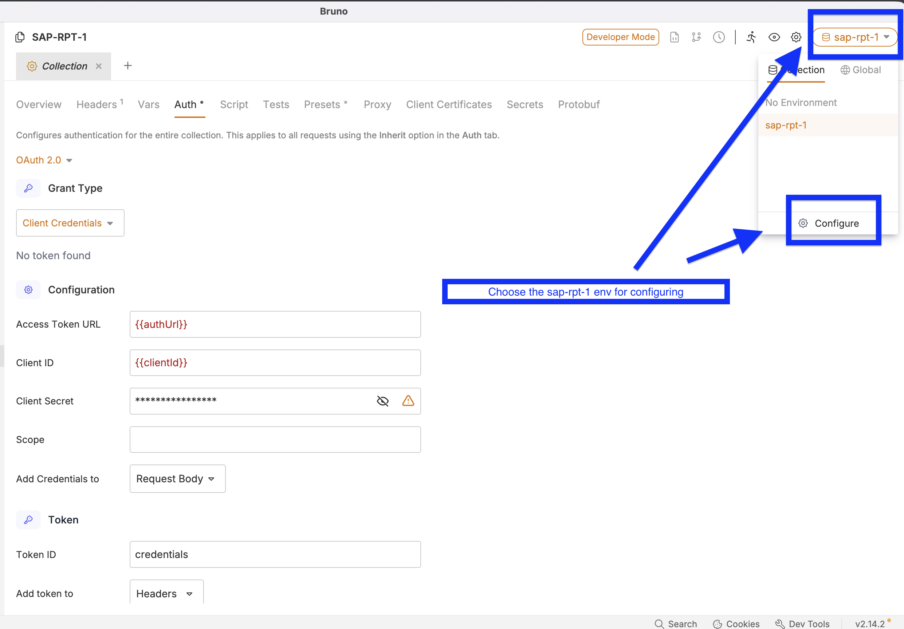
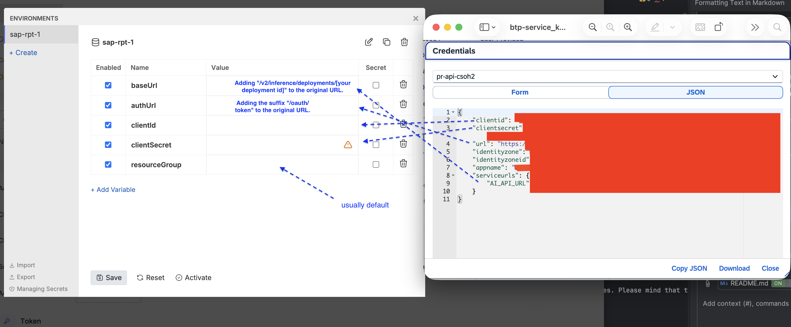
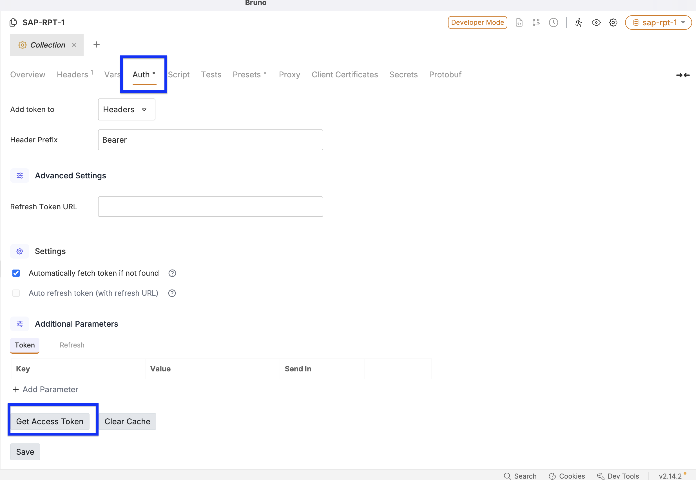

# SAP Relational Pretrained Transformer Samples
 

## Description
This repository contains a Bruno API collection and code samples for using SAP Relational Pretrained Transformer (RPT) models.

## SAP-RPT-1
The Bruno API collection and code in [/sap-rpt-1](/sap-rpt-1/) show how to make predictions on tabular data using the REST API of SAP RPT-1. Please note that you need a service instance of SAP AI Core (service plan "extended") and a deployment of the model (e.g. `sap-rpt-1-small` or `sap-rpt-1-large` - see [SAP AI Core documentation](https://help.sap.com/docs/sap-ai-core/sap-ai-core-service-guide/what-is-sap-ai-core?locale=en-US) and [tutorials](https://developers.sap.com/tutorials/ai-core-genaihub-provisioning..html)).

### Get Service Key

To obtain your service key:

1. Navigate to your BTP subaccount overview page.
2. Navigate to your BTP service instance page and Click on the `SAP AI Core` instance to view the service key details.

### Generate AUTH_TOKEN

To generate your authentication token, please refer to [this link](https://help.sap.com/docs/sap-ai-core/sap-ai-core-service-guide/get-auth-token-for-orchestration).

### Bruno API Collection

- Install [bruno](https://www.usebruno.com/), then [open the collection](https://docs.usebruno.com/get-started/import-export-data/import-collections) (use <b>Open Collection</b>).

- Configuring sap-rpt-1 environment .
> **Important Note**
> The baseUrl and authUrl need to be modified by the above picture.
- Get the Oauth Token.
- You can verify that your access token should work by sending the request in bruno.

## How to obtain support
[Create an issue](https://github.com/SAP-samples/sap-rpt-samples/issues) in this repository if you find a bug or have questions about the content.

For additional support, [ask a question in SAP Community](https://answers.sap.com/questions/ask.html).

## Contributing
If you wish to contribute code, offer fixes or improvements, please send a pull request. Due to legal reasons, contributors will be asked to accept a DCO when they create the first pull request to this project. This happens in an automated fashion during the submission process. SAP uses [the standard DCO text of the Linux Foundation](https://developercertificate.org/).

## License
Copyright (c) 2025 SAP SE or an SAP affiliate company. All rights reserved. This project is licensed under the Apache Software License, version 2.0 except as noted otherwise in the [LICENSE](LICENSE) file.
